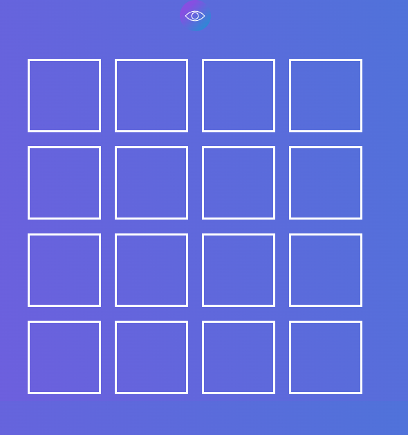
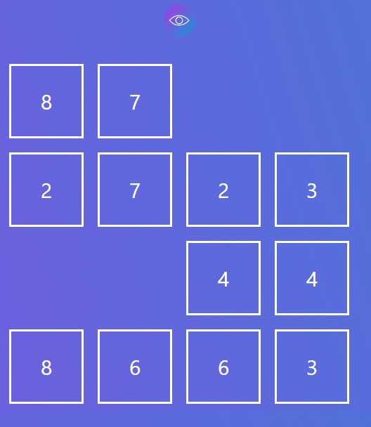
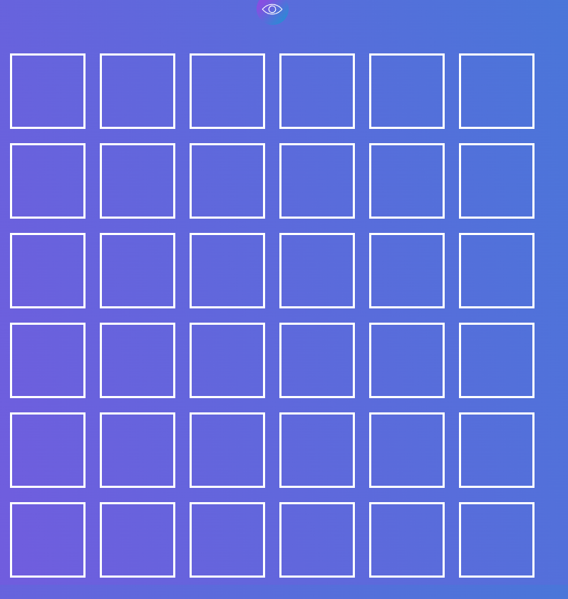

🎮 The project is a game for developing attentiveness, where users search for paired numbers. The game includes multiple difficulty levels, the ability to reset the level, and a score and statistics display that allows players to track their progress. The game provides users with an interactive and fun way to improve concentration and visual memory. Suitable for all ages and can be used for both entertainment and educational purposes.

<h2> 🧰 Languages and Tools </h2>

 

<h2> 📱 Interface </h2>

<h3> 🕹️ The Game  </h3>

<h3> 👀 Displaying results </h3>

<h3> 📈 Another level  </h3>

